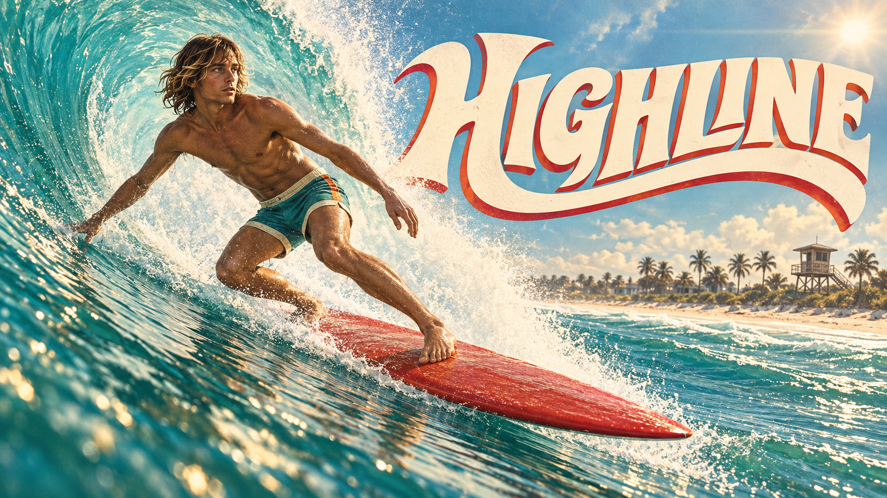

# Highline

Catch a wave, find your line, and carry the landing into the next move. **Highline** is a touch-first Unity surfing prototype set in Satellite Beach, Florida, by King Made.

**[Play Highline](https://kingmadellc.github.io/Highline/)** · [Version 0.23.2](https://kingmadellc.github.io/Highline/releases/0.23.2/?v=0.23.2) · [King Made](https://kingmade.co/games/#highline)

[](https://kingmadellc.github.io/Highline/)

*Illustrated key art, 1672 × 941. [Open the full-resolution artwork](releases/0.23.2/Brand/highline.png).*

## Play

Use landscape orientation on a phone, or open the game in a desktop browser. The release contains roughly **71 MB of unpacked assets**. GitHub serves the core engine and game data with gzip compression: those three requests total about **23.5 MB** (verified September 15, 2026), before supporting artwork, fonts, and audio. Total transfer varies with browser caching; subsequent visits can reuse cached files.

1. Make quick paddle strokes with the swell, then hold the final stroke. Release in the green timing window to stand.
2. Draw low on the wave to build speed. Approach the lip to ride a high line, or push through the crest to launch.
3. Move sideways in the air to rotate, then release before landing. Keep riding to bank the air and preserve momentum.

Practice a line, catch a wave, or try a three-wave filming set. Learn mode helps released rotations settle; Standard asks for more precise landings.

## Current build

**v0.23.2** promotes Rhythm paddling into the normal game, varies the ideal stand-up moment between waves, opens more rideable space in the flats, and makes riding over the back an intentional sustained-line exit. Lip grinds now last at most 2.6 seconds, permit one style switch, and require a one-second fins-set recovery before another grind. The rider’s screen-left arm now follows the moving body with a lower, softer elbow and aligned wrist instead of lagging or lifting into a chicken-wing pose. Everything below from v0.23.1 is included.

**v0.23.1** fills the lineup with a distinct cast: seven men and three women, each with their own build, hair, swimwear and board, with repeats kept apart. Everything below from v0.23.0 is included.

**v0.23.0** combines three streams of work into one update. The ocean has more life: a long fishing pier on the beach that comes into view as the wave carries you in, boats beyond the break (a camera boat pacing you, anchored skiffs, a sailboat and a shrimp trawler), gulls that come and go in singles and loose Vs, lineup surfers sitting on their boards, a fourth wave forming outside and set lines that grow and feather as they reach shallow water. Every wave now has its own character: a thicker or softer lip, lighter or heavier whitewater, a clean or sectiony break, and a shoulder that crumbles into foam and fades instead of running on forever. The shark is new: it stalks with its fin up, drops out of sight, then breaches under you jaws-first and drags you under, leaving your board floating. Air now needs a deliberate pop, lip grinds snap in, switch and snap out, with-motion 360s are easier than against-motion ones, the carve band covers more of the face, and the replay keeps your whole ride with a clear end. The paddle-in has a new experimental timing layer. v0.22.1 corrected the build identity; v0.22 added the pocket meter, guided first wave and board slide. Earlier releases stay available under `releases/`.

This is a browser playtest. Physical-phone performance and controller hardware compatibility remain under evaluation.

## Run this release locally

This repository contains compiled WebGL releases, rather than the editable Unity project. With Git and Python 3 installed:

```sh
git clone https://github.com/kingmadellc/Highline.git
cd Highline
python3 -m http.server 8000
```

Open **http://localhost:8000**. Serve over HTTP instead of opening `index.html` as a local file.

| Path | Purpose |
| --- | --- |
| `index.html` | Entry point for the latest release |
| `releases/0.23.2/` | Versioned game, fonts, audio, and artwork |
| `build-info.json` | Published version, entry point, and exact file hashes |
| `CREDITS.md` | Audio and font attribution |

Versioned directories keep cached game files from different releases separate. Reload an already-open tab after an update.

## Credits and feedback

Created by **King Made**. See [credits](CREDITS.md) for the audio and font sources. Artwork and audio retain their respective rights and license terms; this repository does not declare a general open-source license.

[Report a reproducible issue](https://github.com/kingmadellc/Highline/issues) with the build version, browser, device, and steps to reproduce.
