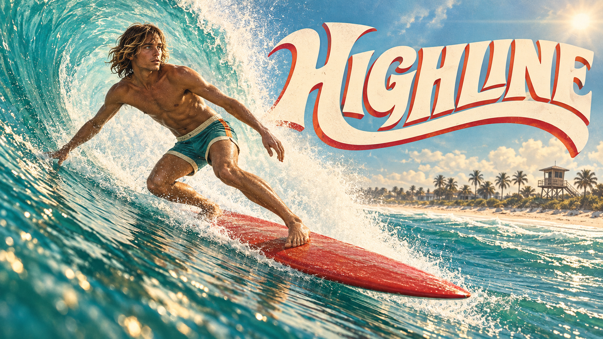

# Highline

Catch a wave, find your line, and carry the landing into the next move. **Highline** is a touch-first Unity surfing game set in Satellite Beach, Florida, by King Made.

**[Play Highline](https://kingmadellc.github.io/Highline/)** · [Version 0.43.0](https://kingmadellc.github.io/Highline/releases/0.43.0/?v=0.43.0) · [King Made](https://kingmade.co/games/#highline)

[](https://kingmadellc.github.io/Highline/)

*Illustrated key art, 1672 × 941. [Open the full-resolution artwork](releases/0.43.0/Brand/highline.png).*

## Current release: 0.43.0

**[Play Highline 0.43.0](https://kingmadellc.github.io/Highline/releases/0.43.0/?v=0.43.0)** on your phone in landscape or in a desktop browser. The main Play Highline link opens this same release.

More foam and spray at the honeyhole, a progressive wave exit, richer water detail, and stronger celebrations. Mix it up now visits all five takes evenly, remembers the rotation across visits, and preserves the selected take in highlights. Includes the installed iPhone full-screen correction.

Unity export succeeded with zero errors and one build warning; all 56 editor gates and 248 compiled browser checks passed. Physical iPhone and Safari acceptance remain pending; this release is published for owner phone testing.

## Play

Use landscape orientation on a phone, or open the game in a desktop browser. Allow the initial game download to finish, then select **Let it rip**. Subsequent visits can reuse cached assets.

1. Pull down and hold through four paddle strokes with the swell. Release in the green timing window to stand.
2. Draw low on the wave to build speed. Reach the crest for a grounded grind; use a deliberate flick or circle there to launch.
3. Move sideways in the air to rotate, then release before landing. Keep riding to bank the air and preserve momentum.

Practice a line, catch a wave, or try a three-wave filming set. Learn mode helps released rotations settle; Standard asks for more precise landings.

## Earlier builds

**[v0.42.1](https://kingmadellc.github.io/Highline/releases/0.42.1/?v=0.42.1)**

Fixes empty borders on iPhone while keeping controls clear of the notch and Home indicator.

**[v0.42.0](https://kingmadellc.github.io/Highline/releases/0.42.0/?v=0.42.0)**

Today’s Wave is now the main event: one shared Satellite Beach morning wave, unlimited attempts, and an automatically posted daily best. The cleaner menu puts Surf now, Best and World first. Free Surf, First Wave lessons, Surf Club and the journal remain close by. Global standings are in beta with basic submission validation.

Unity’s required editor gates and WebGL export passed. The daily loop, score preservation, shared standings and responsive menus were checked in Chromium with an isolated score database. The daily publisher and score service have focused automated coverage. The leaderboard does not yet replay gameplay on the server; physical-device and Safari acceptance remain open.


**[v0.41.0](https://kingmadellc.github.io/Highline/releases/0.41.0/?v=0.41.0)**

Start with a guided First wave, resume your lesson, follow clearer Summer assignments, and Keep photo & continue into the next session. Weekly prompts add new reasons to return; scoring rewards varied surfing and reduces repeated-pair farming. Free Surf, existing keepsakes, accepted cover art, and the six-page Summer issue remain available. Optional playtest notes stay local, off by default, and under player control.

Unity Web build passed with zero errors and warnings. Chromium verification passed 442 journey/menu assertions from phone-sized viewports through 4K, 139 consent/export/erase assertions, and 24 earned-photo persistence/continuation assertions. Automated checks are not human playtests. Desktop Chrome is the verified browser path for this release. Pinned Playwright WebKit 26.0 reproduces fullscreen blank output and incomplete rider rendering on both 0.40 and 0.41; Safari and physical iPhone acceptance remain open. Compact Club strip text at 4K still needs polish. Native signing, TestFlight, device haptics/audio/VoiceOver/performance and human retention testing are not verified.


**[v0.40.0](https://kingmadellc.github.io/Highline/releases/0.40.0/?v=0.40.0)**

How to play: a 48-second tutorial film captured from the game itself, reachable from the cover (play mark on the key art), the pause menu, and the start screen under Let it rip. It walks through paddling (strokes, hold the last one, release in the green), standing up, drawing your line, tricks (air, spin, grab, 180 slide) and scoring (pocket, FLOW, clean finish, ride card). The pause control is now a lighter translucent disc with the same tap target. Otherwise the 0.39.0 game.

Unity Mac and WebGL builds with zero errors and warnings and all editor suites; 64 browser assertions across desktop and phone viewports covering the start-screen link and dialog, the cover and pause routes, chapter seek, play/pause, Close/Escape, 44-point targets and text fit; native review captures of every screen at 1280x720 and 844x390. Physical iPhone playback remains pending. Public history contains the compiled release and release metadata only.


**[v0.39.0](https://kingmadellc.github.io/Highline/releases/0.39.0/?v=0.39.0)**

Five quick play improvements: condition BEST records and NEW BEST stamps; a clearer first catch with a paddle hint and swell swash; Drop in again after a wipeout, 25 metres back on the same wave as a practice attempt; tier chimes, rising pocket ticks and brief landing/slide beats; and a guaranteed first shark cameo followed by a 15% chance. The existing board hiss and rail audio remain. Choose the record to chase in Options → Session & more → Wave.

Unity validation and the WebGL build passed with zero errors or warnings. A 22-check browser test used real keyboard/mouse input to verify condition selection, the welcome, a full catch, wipeout, stable retry choices, same-seed practice drop-in and a full eligible paddle retry. Loading-shell layouts passed at small-phone through 4K sizes. Native builds, physical-device play and listening tests remain pending.


**[v0.38.0](https://kingmadellc.github.io/Highline/releases/0.38.0/?v=0.38.0)**

Promotes the approved 0.37.0-playtest3 candidate to release 0.38.0 with only the version changed.

Built from the approved 0.37.0-playtest3 source with only the version changed. The QA follow-through candidate passed all 40 Unity editor suites with zero errors and warnings, deterministic and real-time browser probes, phone/small/4K menu, gameplay and tube-exit checks, and a native Mac Retina check; the hosted Playtest 3 build re-passed the barrel, landing, shark, portrait, reduced-motion, rules and replay probes and was approved by the owner after playing it.


**[v0.36.0](https://kingmadellc.github.io/Highline/releases/0.36.0/?v=0.36.0)**

Surf Club pairs each activity with its own Highline scene: surfing, dunes, an aerial, filming and printmaking. Ride Journal and Results display photographs from the player's actual session or completed ride. The repeated decorative barrel pictures are retired, and menu artwork now releases unused memory when moving between screens.

Verified at phone display density and 4K with 86 browser checks, 21 native scene-rendering checks, and the standard keyboard-client smoke. The Unity build completed with zero errors and warnings. Actual ride photos retain their source identity through saving, resizing and reload. Physical-phone acceptance remains open for this release.


**[v0.35.0](https://kingmadellc.github.io/Highline/releases/0.35.0/?v=0.35.0)**

Completes responsive magazine and photo menus, adds celebration selection and animated previews, Free Surf score preferences, dated historical sessions and current regional NOAA conditions delivery. Preserves approved startup artwork and the five handling modes and tube-exit celebrations.

Successful Unity WebGL build with zero errors or warnings; 1673 actual-player browser assertions across phone and 4K layouts, all five exits and replays, saved photos and native scene exports, fresh observations and offline fallbacks. Preview pixels, resizing and paused-ride preservation verified. Physical-device playtesting remains open; original approved illustrations retain source resolution and photo exports adapt to measured memory headroom. Automatic observation-feed scheduling is configured but its first scheduled run remains unverified.


**[v0.34.0](https://kingmadellc.github.io/Highline/releases/0.34.0/?v=0.34.0)**

Carving now builds speed through connected turns, with five more distinct handling settings and scoring that rewards varied lines. Clean tube exits have a quicker double-shaka and return to paddling, and caught exits keep the fall readable above the controls.

Menus render at the display backing resolution, and saved surf photos use native capture resolution within available memory. The approved cover, Beach Bulletin and Surf Club artwork remain intact. Further Photo Desk and archive layouts, and selectors for additional celebrations and observed conditions, are still in development.

Verified with a successful Unity WebGL build with zero errors or warnings, automated gameplay and exit checks, phone-density and 4K browser menu checks, and native photo save/reload/export checks. Physical iPhone playtesting and subjective handling feedback remain open. Historical observed conditions are available to the underlying system; current browser data requests fall back explicitly when the provider blocks cross-origin access.


**[v0.33.2](https://kingmadellc.github.io/Highline/releases/0.33.2/?v=0.33.2)**

Beach Bulletin now uses crisp live brand text and scalable pinned cards from phones through 4K displays. The four surf modes retain their approved order, real Free Surf conditions and fixed issue footer. Full-card touch targets activate on release, scrolling preserves every description, and Cover remains available. The approved main menu, original animated key-art loading screen, other menus and gameplay are preserved.

Reviewed candidate: 496 Beach browser checks, 235 main/startup checks and 1,939 conditions assertions. The committed 0.33.2 release rebuild has zero errors/warnings and passes 197 fresh phone/4K browser checks. Physical iPhone Home Screen and Apple TV hardware acceptance remain separate.


**[v0.33.1](https://kingmadellc.github.io/Highline/releases/0.33.1/?v=0.33.1)**

The original animated Highline key art returns at startup, covering engine loading until Let it rip opens the main menu. The approved editorial menu now uses sharp live brand text, larger touch targets and responsive layouts, with a logo-free Space Coast scene showing the crew watching a launch. The fixed magazine issue line, existing Surf Club styling, recorded photos and gameplay remain intact. Beach Bulletin retains its four-card arrangement with a clearer Back action.

The production WebGL build completed with zero errors and warnings. All 235 focused browser checks passed across six viewport sizes with standard and larger text, covering layout fidelity, display density, safe bounds, touch and keyboard navigation, submenu returns, covered startup handoff and entry into Free Surf. The headed action-client check also passed. Physical iPhone Home Screen, native iOS and controller hardware acceptance remain separate checks.


**[v0.33.0](https://kingmadellc.github.io/Highline/releases/0.33.0/?v=0.33.0)**

Six approved print-style menus now connect the cover, Beach Bulletin, Ride Journal, Surf Club, darkroom Results and workshop Options. Live conditions, earned journal and club records, persistent preferences and recorded-pose photographs ship together, preserving the approved surfer, waves and fixed magazine branding.

The combined production build passed all 45 Unity validation groups with zero build errors or warnings, 220 browser menu checks, 143 main-cover layout/art checks and 53 recorded-photo checks. Photo selection, native-size PNG exports and image persistence after reload were verified. Separate graphics-enabled editor checks covered distinct carve, air and tube captures. Physical-device performance, audio and Apple certification remain unverified.


**[v0.32.0](https://kingmadellc.github.io/Highline/releases/0.32.0/?v=0.32.0)**

**[Play Highline 0.32.0](https://kingmadellc.github.io/Highline/releases/0.32.0/?v=0.32.0)** on your phone in landscape or in a desktop browser.

The approved surfer appearance joins the taller, wider tube and breaking-wave improvements in one build. Both hands give a shaka after a clean tube exit, then the surfer lowers onto the board and paddles offshore. The highlight replay includes the full exit sequence. Four-stroke paddling, responsive carving, deliberate jumps, grounded crest grinds and varied wipeouts remain available.

All combined Unity editor validation gates passed. WebGL built with zero errors and warnings. Validation includes 120 catch-to-tube routes, 32 wider tube entries, nine camera-clearance routes, 601 character exit-animation samples and 24 production browser assertions with no page errors. The exit, return paddling and highlight replay were visually inspected. Physical-phone feel and performance remain unverified.

**[v0.31.0](https://kingmadellc.github.io/Highline/releases/0.31.0/?v=0.31.0)**

The wave now pitches down into a breaking roller and spreads into fading whitewater. Its distant ends stay anchored in the ocean, and the tube exit follows an open shoulder while the breaking section closes behind the surfer. Waves continue collapsing after the ride, with a short unobstructed ride-out before the results card. Four-stroke paddling, deliberate jumps, crest grinds, varied wipeouts and the controls from 0.30.0 remain available.

All Unity editor gates passed; WebGL built with zero errors and warnings. Validation includes 24 seeded wave-lifecycle scenarios, 120 catch-to-tube routes, nine camera-clearance routes, replay checks, and 15 production browser assertions covering paddling, crest grinding, a clean tube exit, and post-ride dissipation. Rendered collapse sequences were inspected. This is a research-informed parametric game model. Physical-phone feel and performance remain unverified.

**[v0.30.0](https://kingmadellc.github.io/Highline/releases/0.30.0/?v=0.30.0)**

Longer ride-through tubes with a clean exit, faster carving and trim recovery, more varied wave height/speed/grip/foam response, and grounded crest grinds unless a jump or over-back exit is deliberate. Catch waves with four paddle strokes. Five articulated wipeout motions and new surfboard paddle recordings add variety. Credits are in Options.

All Unity editor gates passed; WebGL built with zero errors and warnings. Checks include 120 catch-to-tube routes, 60 additional seeded ride-throughs, five distinct wipeout trajectories, 227 audio asset checks, 10 focused browser checks, and 95 real-time touch assertions. Physical-phone feel, audio listening and performance remain unverified.

**[v0.29.1](https://kingmadellc.github.io/Highline/releases/0.29.1/?v=0.29.1)**

Catch waves with one sustained mouse pull, touch pull, controller hold, or Space hold, then release in the clearly marked green window. The SWELL meter explains when to paddle, failed-drill retry stays in place, and Options now includes keyboard and gesture controls.

Verified with 36 Unity editor check groups, 53 real-time browser checks covering mouse and keyboard catches in all three entry routes plus a separate touch smoke, rendered Controls review at desktop and small landscape sizes, and six first-input/recovery/mute audio groups in each of Chromium and WebKit. Physical iPhone listening, touch feel and performance remain unverified.

**[v0.29.0](https://kingmadellc.github.io/Highline/releases/0.29.0/?v=0.29.0)**

Five handling settings from Arcade to Simulation, symmetric circle controls, easier crest ollies and 180-in/slide/180-out transitions. Three surf POV paddle recordings and expanded water banks vary without adjacent repeats. Editorial magazine menus, revised surfer anatomy and materials, screened photography, more varied foam, improved board contact and smoother rendering complete this pass. Existing saves and owned photographs remain intact; new shots use the revised renderer.

All 34 Unity validation groups passed with zero build errors or warnings. Browser checks passed for 95 real-time gesture assertions, 12 handling/menu checks, 145 magazine checks, 11 inspected full-resolution photographs and compiled 0.28-to-0.29 save continuity. Chromium and WebKit audio recovery passed; 227 offline audio checks and 31 distinct recorded-water browser checks are retained. Desktop profiling found no repeated presentation clocks across 482 sampled frames; water CPU cost stayed roughly unchanged. Physical iPhone listening, touch feel and performance remain unverified. This is a browser playtest.


**[v0.28.0](https://kingmadellc.github.io/Highline/releases/0.28.0/?v=0.28.0)**

Browser sound now starts and recovers through the existing audio context, the wave blocks far-side foam, ordinary faces are roughly six to seven feet, and rebuilt Blender hand alignment drives connected shoulder-led surfing balance. The tube camera and physical exit opening keep the rider readable. Earlier photos and summer progress remain owned.

Verified with 31 Unity validation groups, a zero-error/zero-warning WebGL build, 89 production-touch progression checks, stepped and real-clock motion checks, compiled audio output and recovery in Chromium and WebKit, and actual 0.27-to-0.28 save continuity. Physical-phone listening and comfort remain device checks.


**[v0.27.0](https://kingmadellc.github.io/Highline/releases/0.27.0/?v=0.27.0)**

Hightower Summer turns six surfing assignments into a personal six-page issue. Keep favorite photographs, read authored wave sequences, choose guided barrels or earn controlled exits, take optional focused practice back to your original wave, share exact-wave cover invitations, and follow a short original Space Coast chapter. Six editorial prompts stay available. Browser progress uses stable storage with a tested upgrade from 0.26.

Verified WebGL candidate: 30 editor gate groups; 89 production-touch checks with no browser errors; four actual browser-save migration scenarios; six focused manual-tube checks; inspected cover, story, invitation and small-phone layouts. Build has zero errors/warnings. Human enjoyment and physical-phone acceptance remain unmeasured. Native iOS source is included in the private authoring repository, but the missing iOS toolchain prevents a signed iOS release.


**[v0.26.0](https://kingmadellc.github.io/Highline/releases/0.26.0/?v=0.26.0)**

A coordinated surfing polish pass: rail-driven spray and landing water, connected whole-body motion, deeper wave shading, smoother cameras, immediate next-wave actions, refined beach atmosphere, and better recorded magazine photographs.

Verified integrated WebGL build and 392 production browser assertions, including small-screen layouts, audio controls, replay isolation, and pixel-identical cover save/reload/export. Paired desktop rendering performance remains effectively unchanged from 0.25.1. Formal human playtests and physical-phone validation remain deferred.


**[v0.25.1](https://kingmadellc.github.io/Highline/releases/0.25.1/?v=0.25.1)**

This update brings recorded water into the surf: ocean and shoreline ambience, board glide and loaded turns, varied spray and landings, and a distinct barrel wash. Paddle splashes follow the animated hands meeting the water. The barrel sound follows actual wave coverage, while pause, mute, menus, and replay silence the affected layers. [Sound credits](releases/0.25.1/credits.html).

All existing surfing, natural arm balance, focused practice, Free Surf, magazine covers, wave challenges, and replay features remain available. From a ride, use **Pause → Beach menu → Surf club** to explore the modes.

The package grew about 2.1 MB to 77.1 MB of unpacked build content; actual transfer depends on hosting compression and caching. The paired desktop frame-time sample was unchanged. Physical-phone listening, sustained performance, and player enjoyment remain playtest questions. Earlier versioned builds stay available.


**v0.23.2** promotes Rhythm paddling into the normal game, varies the ideal stand-up moment between waves, opens more rideable space in the flats, and makes riding over the back an intentional sustained-line exit. Lip grinds now last at most 2.6 seconds, permit one style switch, and require a one-second fins-set recovery before another grind. The rider’s screen-left arm now follows the moving body with a lower, softer elbow and aligned wrist instead of lagging or lifting into a chicken-wing pose. Everything below from v0.23.1 is included.

**v0.23.1** fills the lineup with a distinct cast: seven men and three women, each with their own build, hair, swimwear and board, with repeats kept apart. Everything below from v0.23.0 is included.

**v0.23.0** combines three streams of work into one update. The ocean has more life: a long fishing pier on the beach that comes into view as the wave carries you in, boats beyond the break (a camera boat pacing you, anchored skiffs, a sailboat and a shrimp trawler), gulls that come and go in singles and loose Vs, lineup surfers sitting on their boards, a fourth wave forming outside and set lines that grow and feather as they reach shallow water. Every wave now has its own character: a thicker or softer lip, lighter or heavier whitewater, a clean or sectiony break, and a shoulder that crumbles into foam and fades instead of running on forever. The shark is new: it stalks with its fin up, drops out of sight, then breaches under you jaws-first and drags you under, leaving your board floating. Air now needs a deliberate pop, lip grinds snap in, switch and snap out, with-motion 360s are easier than against-motion ones, the carve band covers more of the face, and the replay keeps your whole ride with a clear end. The paddle-in has a new experimental timing layer. v0.22.1 corrected the build identity; v0.22 added the pocket meter, guided first wave and board slide. Earlier releases stay available under `releases/`.

This is a browser playtest. Physical-phone performance and controller hardware compatibility remain under evaluation.

## Run this release locally

This repository contains compiled WebGL releases, rather than the editable Unity project. With Git and Python 3 installed:

```sh
git clone https://github.com/kingmadellc/Highline.git
cd Highline
python3 -m http.server 8000
```

Open **http://localhost:8000**. Serve over HTTP instead of opening `index.html` as a local file.

| Path | Purpose |
| --- | --- |
| `index.html` | Entry point for the latest release |
| `releases/0.33.0/` | Versioned game, fonts, audio, and artwork |
| `build-info.json` | Published version, entry point, and exact file hashes |
| `CREDITS.md` | Audio and font attribution |

Versioned directories keep cached game files from different releases separate. Reload an already-open tab after an update.

## Credits and feedback

Created by **King Made**. See [credits](CREDITS.md) for the audio and font sources. Artwork and audio retain their respective rights and license terms; this repository does not declare a general open-source license.

[Report a reproducible issue](https://github.com/kingmadellc/Highline/issues) with the build version, browser, device, and steps to reproduce.
